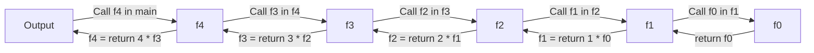
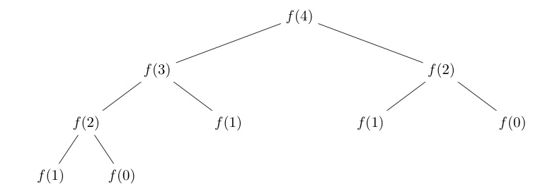
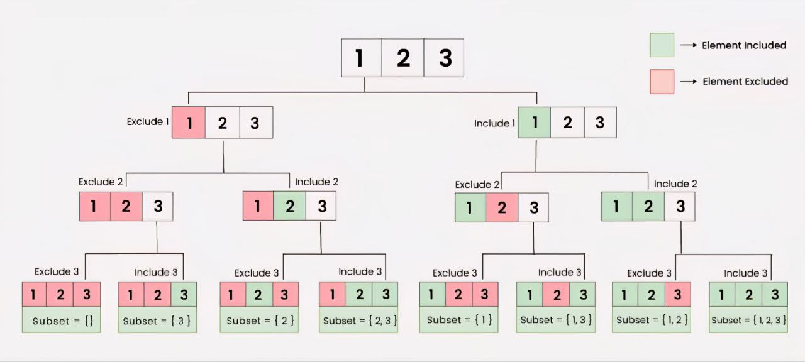

### تابع بازگشتی
بازگشتی یک تکنیک برنامه نویسی هستش که تابع خودش رو درون خودش با پارامتر های متفاوت صدا میکنه تا زمانی که به حالت پایه خودش برسه و متوقف بشه. <br>
> عملا به ما امکان این رو میده که مسئله رو به زیر مسئله های کوچیک تر و قابل مدیریت تر تجزیه کنیم و راه حل های زیبا و خلاقانه ای ارائه بدیم.

احتمالا گیج شدین ولی ایرادی نداره بریم چند تا مثال ببینیم:

#### مثال 1

$f(n) = n!$ <br>
این تابع فاکتوریل هستش که باهاش آشنا هستین و خب ما اگه بخوایم این رو به صورت یک عبارت بازگشتی بنویسیم به این شکل خواهد بود: <br>
$f(n) = n * f(n - 1)$ <br>
یک حالت پایه هم میخوایم که وقتی به اون رسیدیم متوقف بشه کار که اون صفر هستش ($f(0) = 1$) <br>
به دو حالت میشه کد این تابع رو زد:

=== "For loop & Array"

    ```cpp
    #include <iostream>
    using namespace std;

    int main(){
        int n = 10;
        int f[n];
        f[0] = 1; // (1)!
        for (int i = 1; i < 10; i++){
            f[i] = i * f[i - 1]; // (2)!
        }
        cout << f[9];
        // output:
        // 362880 -> 9!
        return 0;
    }
    ```

    1. این همون حالت پایه هستش که گفته شد.

    2. این همون عبارت بازگشتی تابع فاکتوریل هستش به این شکل که در حال حاضر مقادیر `f[0]` تا `f[i-1]` حساب شدن و  حالا میخوایم مقدار `f[i]` رو محاسبه کنیم.

=== "Recursive Function"

    ```cpp
    #include <iostream>
    using namespace std;

    int f(int n){
        if (n == 0){
            return 1; // (1)!
        }
        return n * f(n - 1); // (2)!
    }

    int main(){
        cout << f(4);
        // output:
        // 24 -> 4!
        return 0;
    }
    ```

    1. تابع انقد صدا زده میشه و به زیر مسئله کوچیکتر تبدیل میشه که در نهایت برسه به حالت پایه که صفر هست و تو این `if` هندل میشه.

    2. این عبارتمونه و همونطور که میبینین تابع توی خودش صدا زده شده و مسئله به یک زیر مسئله کوچیکتر (n - 1 تایی) تبدیل شده.

میتونیم روند انجام عملیات ها توی تابع بازگشتی رو به صورت نمودار زیر ببینیم:



> به عبارتی وقتی از توی `main` تابع `f(4)` صدا زده میشه یک روند بازگشتی با صدا کردن حالت یدونه کوچیکتر شروع میشه تا در نهایت به 
`f(0)` میرسه که همون حالت پایه اس و هر حالت مقدار خودش رو به ترتیب برای حالت یدونه بزرگترش `return` میکنه و همینجوری انگار همون مسیر رفته رو برمیگرده و همه از `f(1)` تا `f(4)` به ترتیب مقدارشون حساب میشه و در نهایت خروجی به سمت `main` میره.

عملا وقتی تابع داره اجرا میشه و پارامترش `n = 4` هستش و در `Function body` مقدار `f(3)` صدا زده شده کامپیوتر انگار میره یک صفحه جدید برای خودش باز میکنه و از اول تابع رو شروع میکنه به ران کردن ولی این دفعه با پارامتر `n = 3` در نهایت وقتی به `return` رسید تو این حالت مقداری که `return` شده رو میفرسته به صفحه قبلی که توش بود یا عملا `Function body` حالت `n = 4` و این مقدار رو به جای `f(3)` استفاده میکنه.


!!!warning "اشتباه رایج"
    خیلی ها دقت نمیکنن و تابع بازگشتی بالارو به این شکل پیاده میکنن:

    ```cpp
    #include <iostream>
    using namespace std;

    int f(int n){
        return n * f(n - 1);
        if (n == 0){
            return 1;
        }
    }

    int main(){
        cout << f(4);
        return 0;
    }
    ```

    در اینجا چون شرط بررسی اینکه به حالت پایه رسیدیم رو پایین تر از خطی نوشتیم که داریم حالت کوچیکتر رو صدا میکنیم تابع هیچ وقت شرط رو بررسی نمیکنه و تا ابد همینطوری مقدار کوچیکتر رو صدا میکنه.
    ``` mermaid
    graph LR
        A[Output] --> B[f.4];
        B --> C[f.3];
        C --> D[f.2];
        D --> E[f.1];
        E --> F[f.0];
        F --> G[f.-1];
        G --> H[f.-2];
        H --> I[...];
    ```

    پس احتمالا الان فهمیدین که چرا ما حالت پایه تعریف میکنیم به خاطر اینکه یه جا تابع باید متوقف بشه و تا ابد همینطوری قبلی اش رو صدا نکنه.

    <b>و حواستون هم باشه پس که همیشه شرط بررسی اینکه به حالت پایه رسیدیم یا نه رو همون اول بررسی کنید! </b>

---

#### مثال 2

$f(n) = f(n - 1) + f(n - 2)$ <br>
این تابع فیبوناچی هستش که باهاش آشنا هستین.
حالت پایه فیبوناچی دوتا عدد هست بدین شکل:

- $f(0) = 0$

- $f(1) = 1$

و کدش رو میشه به دو حالت پیاده سازی کرد:

=== "For loop & Array"

    ```cpp
    #include <iostream>
    using namespace std;

    int main(){
        int f[10];
        f[0] = 0;
        f[1] = 1;
        for (int i = 2; i < 10; i++){
            f[i] = f[i - 1] + f[i - 2];
        }
        cout << f[9];
        // output:
        // 34
        return 0;
    }
    ```

=== "Recursive Function"

    ```cpp
    #include <iostream>
    using namespace std;

    int f(int n){
        if (n == 0){
            return 0;
        }
        if (n == 1){
            return 1;
        } // (1)!
        return f(n - 1) + f(n - 2);
    }

    int main(){
        cout << f(4);
        // output:
        // 3
        return 0;
    }
    ```

    1. چون دوتا حالت پایه داریم جفتش رو بررسی میکنیم همین اول تابع.

چون تابع بازگشتی فقط یک بار خودش رو صدا نزده بلکه دوبار خودش رو  درون خودش صدا زده , نمودارش به این شکل در میاد (درخت میشه):



پایین ترین مقدار ها که دیگه پایین تر نرفتن میشن حالت های پایه ما (`f(0) & f(1)`) که وقتی به اون ها رسیدیم پروسه `return` کردن شروع میشه و مقادیر به سمت بالا برمیگردن تا برسن به مقدار بالایی که `f(4)` هستش.

!!! note "چرا دوتا مقدار پایه داریم؟"
    به این علت که ما توی تابع مون دوبار خود تابع رو صدا میکنیم یا به عبارتی از دو تا مقدار کوچیکتر برای حساب کردن مقدار مورد نظر استفاده میکنیم. پس یک نقطه ای باید باشه که تابع مون از <b>دو تا مقدار پایه</b> برای حساب کردن مقدار فعلی استفاده کنه وگرنه تا ابد همینجوری تابع , صدا کردن مقدار کوچیکتر رو ادامه خواهد داد.

---

### Backtracking

بک ترکینگ (پس گرد) یک استراتژی حل مسئله هستش که با استفاده از تابع بازگشتی و امتحان کردن هر مسیر ممکن و برگشت از اون مسیر به حل مسئله میپردازد.

#### مسئله
یک وکتور داریم و میخواهیم تمام زیر مجموعه های ممکن این وکتور رو چاپ کنیم.

```cpp
#include <iostream>
#include <vector>
using namespace std;

void f(vector<int> Vec, vector<int> Ans, int currentCell){
    if (currentCell == Vec.size()){
        cout << "{ ";
        for (int x: Ans){
            cout << x << ' ';
        }
        cout << '}' << endl;
        return;
    }
    
    Ans.push_back(Vec[currentCell]);
    f(Vec, Ans, currentCell + 1);
    Ans.pop_back();
    f(Vec, Ans, currentCell + 1);
}

int main(){
    vector<int> Vec = {1, 2, 3};
    f(Vec, {}, 0); // (1)!
    // Output:
    // { 1 2 3 }
    // { 1 2 }
    // { 1 3 }
    // { 1 }
    // { 2 3 }
    // { 2 }
    // { 3 }
    // { }
    return 0;
}
```

1. اینجا میخواستم وکتور خالی بفرستم به پارامتر `Ans` تابع و به این شکل نوشتمش. <br>
 مقدار اولیه دادن به وکتور به این شکل بود `{3 ,2 ,1}` پس با این اوصاف وکتور خالی میشه `{}`.

 <b> استراتژی چیه؟ </b> (با شکل نمودار بازگشتی زیر راحت تر میفهمین) <br>
به طور کلی ما میخوایم به شکل بازگشتی تمام زیر مجموعه هارو بسازیم. <br>
یک متغیر `currentCell` میگیریم که برابر خونه وکتوری هستش که در حال حاضر روش هستیم. <br>
میخوایم به طور بازگشتی تمام زیر مجموعه های مقدار های وکتور از `currentCell` تا آخر رو بسازیم و به همراه مقادیر فعلی وکتور `Ans` خروجی بدیم. (یک سری مقادیر هستن توی وکتور `Ans` که در استیت های قبلی بازگشتی از خونه های `0` تا `currentCell - 1` پوش بک شدن) <br> 
این زیر مجموعه ها به دو دسته تقسیم میشن یا دارای مقدار خونه `currentCell` وکتور `Vec` هستن یا نیستن. <br>
پس ما دو بار تابع رو صدا میکنیم: <br>

- زیر مجموعه هایی که خونه `currentCell` درونشون باشه. <br>
    پس چون قراره خونه `currentCell` رو داشته باشیم اون رو پوش بک میکنیم درون `Ans`. <br>
    و میگیم حالا برو همه زیر مجموعه های از خونه `currentCell+1` تا آخر رو با `Ans` خروجی بده. <br>

- زیر مجموعه هایی که خونه `currentCell` درونشون نباشه. <br>
    همون مثل حالت قبله فقط `currentCell` رو از درون `Ans` پاپ بک میکنیم و میگیم دوباره برو و همه زیر مجموعه های از `currentCell+1` تا آخر رو بدون وجود `currentCell` درون اون زیر مجموعه ها خروجی بده . <br>

> حالت پایه هم وقتیه که همه عدد های وکتور Vec رو دیدیم و تموم شدن حالا باید نتیجه Ans فعلی رو خروجی بدیم.


اگه بخوایم نمودار بازگشتی رو بکشیم باز به شکل درخت خواهد شد چون دوبار خودش رو درون `Function body` صدا کردیم:



برای یادگیری بهتر مفهوم بک ترک, [این ویدیو](https://www.youtube.com/watch?v=gBC_Fd8EE8A) رو هم پیشنهاد میکنم ببینید.

