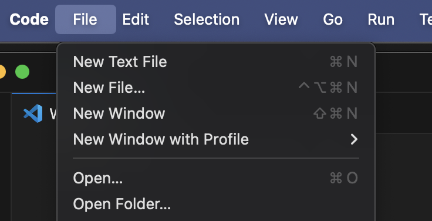
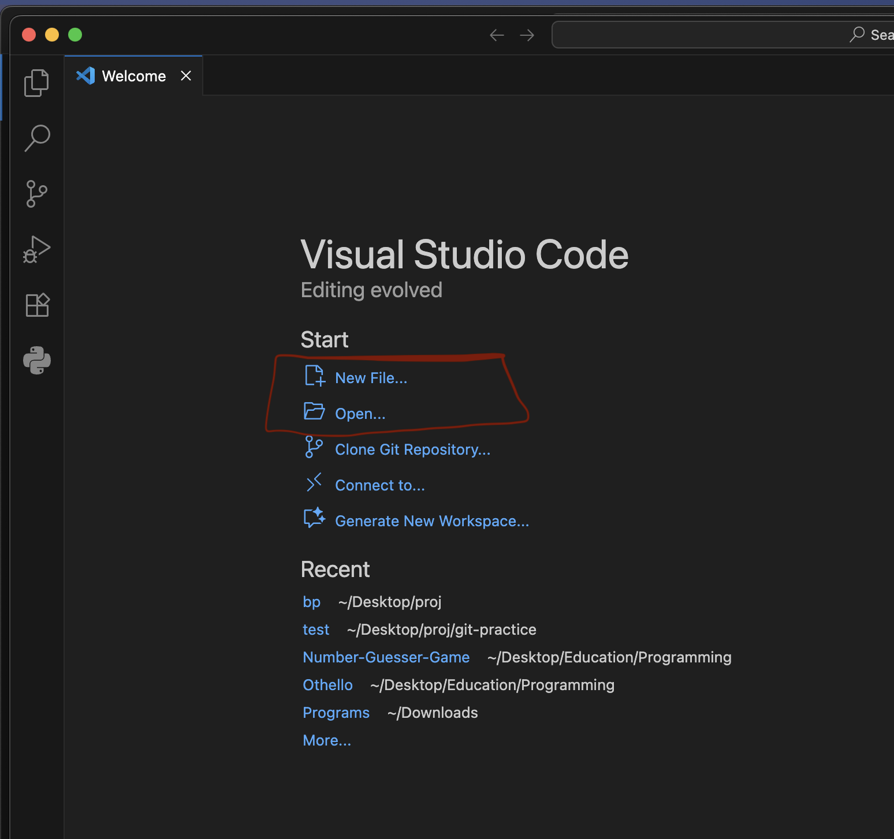

### کامپایلر چیست ؟

درست است در بخش مقدمه گفته شده که زبان برنامه نویسی برای کامپیوتر خوانا هستش ولی بصورت مستقیم کامپیوتر باز هم نمیتونه کد نوشته شده به زبان ++C یا زبان های دیگه ذکر شده رو بخونه. <br>
به صورت خلاصه بخوام بگم زبان کامپیوتر  [زبان ماشین](https://fa.wikipedia.org/wiki/%DA%A9%D8%AF_%D9%85%D8%A7%D8%B4%DB%8C%D9%86){ target=_blank } هستش.
و این وسط یک رابطی باید وجود داشته باشه که کد نوشته شده به زبان های برنامه نویسی مثل ++C رو تبدیل کنه به زبان ماشین که این رابط همون کامپایلر هستش.

!!! tip "نکته"
    * کامپایلر هر زبان برنامه نویسی برای همه ی زبان های برنامه نویسی دیگه کار نمیکنه. <br>
    * شما نیازی نیست زبان ماشین بلد باشین و پروسه تبدیل کد ++C به زبان ماشین رو نخواهید دید و همش بصورت خودکار توسط کامپایلر انجام میشه با اجرا کردن برنامه ای که نوشتین.

----

### نحوه نصب کامپایلر بر روی سیستم

ابتدا باید ببینین که از قبل کامپایلر ++C بر روی سیستمتون نصب هستش یا خیر. <br>

اگر سیستم عاملتون ویندوز هستش [Command prompt](https://www.youtube.com/watch?v=MBBWVgE0ewk){ target = _blank } رو باز کنین. <br>
اگر مک یا لینوکس هستش [Terminal](https://www.youtube.com/watch?v=aKRYQsKR46I){ target = _blank } رو باز کنین. <br>

و بعد دستور زیر رو اجرا کنین:

```shell
    g++ --version
```

اگر بعد از اجرای این دستور پیامی شبیه به این دریافت کردین برای مک و لینوکس:

```shell
    g++: command not found
```

یا برای ویندوز:

```shell
    'g++' is not recognized as an internal or external command,
    operable program or batch file.
```

در این صورت یعنی کامپایلر برای شما نصب نشده  <br>
ولی اگه همچین پیامی دریافت کردید <br>
برای مک:

```shell
    g++ (Homebrew GCC 14.2.0) 14.2.0
```

برای لینوکس:

```shell
    g++ (Ubuntu 13.2.0-23ubuntu4) 13.2.0
```

برای ویندوز:

```shell
    g++ (Rev3, Built by MSYS2 project) 13.2.0
```

به طور کلی یعنی یک عددی به این فرمت `A.B.C` مشاهده کردید که بیانگر ورژن کامپایلر شماس یعنی کامپایلر به درستی نصب شده بر روی سیستم شما و نیازی به نصب مجدد اون نیست و میتونین به [بخش بعدی](#topic-3) برین.

----

#### Mac

با اجرای دستور زیر در ترمینال میتوانید کامپایلر را نصب کنید:

```shell
    brew install gcc
```

اگه اجرا نشد احتمالا بخاطر نصب نبودن [Home brew](https://brew.sh/){ target = _blank } بر روی سیستمتون هستش که میتونید اقدام به نصب اون کنید.

----


#### Linux

با اجرای دستورات زیر در ترمینال میتوانید کامپایلر را نصب کنید:

```shell
    sudo apt update
    sudo apt install build-essential
```

----

#### Windows

!!! failure "اخطار"
    این روش برای ویندوز ۶۴ بیت ۸.۱ و جدید تر هستش و برای ورژن های قدیمی تر جواب نمیده. <br>
    اگر ویندوز ۷ دارید اقدام به دانلود ++Dev C کنین.

میتونین با دیدن [این ویدیو](https://www.youtube.com/watch?v=oC69vlWofJQ){ target = _blank } یا خوندن این [پست](https://code.visualstudio.com/docs/cpp/config-mingw){ target = _blank } و دنبال کردن مراحلش کامپایلر رو نصب کنید.

!!! info "نکته در مورد ویدیو"
     دقت کنید که توی ویدیو و پست قبلی قبل از دانلود کردن کامپایلر یک سری پیش نیاز ها گفته شده که ادیتور Visual studio code و اکستنشن ++C رو نصب کنید که ما در ادامه به نصب آنها خواهیم پرداخت ولی برای نصب کامپایلر نیازی به این پیش نیاز ها نیست.

----


در نهایت بعد از نصب کامپایلر روی سیستم عامل مورد نظر با دستور زیر از نصب شدنش اطمینان حاصل پیدا کنید:

```shell
    g++ --version
```

که بالاتر این دستور رو توضیح دادیم.

----

### ادیتور و محیط کد زنی {#topic-3}

ادیتور (Editor) نرم افزاری است که استفاده میشه برای کد نوشتن درونش و بعد کامپایل کردن اون کد به کمک کامپایلر.

ادیتور های زیادی وجود دارن که یک سری از معروف و محبوب ها در دنیای برنامه نویسی رو این زیر معرفی میکنیم:

!!! note "ادیتور ها"
    * Visual studio code 
    * Vim
    * Sublime ...

ولی در نهایت Visual studio code با اختلاف محبوب ترین ادیتور در نظر برنامه نویس ها بوده و بیشترین استفاده رو داشته و ماهم اینجا نحوه نصب اون رو بهتون نشون میدیم ولی اگر با ادیتور دیگه ای راحت تر هستین هیچ موردی نداره.

!!! info "یک نکته جالب"
     ادیتور یک وسیله ای برای راحت تر و سریع تر کد زدن برنامه نویس هاس که یک محیطی فراهم کنه براشون که سختی کار کمتر بشه و ادیتوری بهتر خواهد بود که این هدف رو بهتر فراهم کرده باشه. <br>
    ولی در نهایت مهم نیست شما تو Visual studio code کد بزنید یا توی Notebook یا حتی در telegram توی پی وی دوستتون
    در نهایت اگه کد نوشته شده رو بدین به کامپایلر اجرا خواهد شد :smile: :smile:

----

### نصب Visual studio code

وارد این [لینک](https://code.visualstudio.com/download){ target = _blank } بشید و مطابق با سیستم عاملتون VS Code رو دانلود کنید.

بعد از نصب VS Code باید اقدام به نصب C++ Extension بکنید.


وارد VS Code شوید و بعد از سمت چپ همانند تصویر بخش Extension رو انتخاب کنید و بعدش توی قسمت سرچ ++C رو بنویسید و Install کنید.

!!! info "نکته"
    این اکستنشن برای اینه که وقتی کدی نوشتین یکم از حالت خشک بودن در بیاد و یک مقدار رنگ و طرح زیبایی به خودش بگیره و چشم شما اذیت نشه. <br>
    همون بحث راحت تر کردن کار برنامه نویسه :fontawesome-regular-face-laugh-wink:

---

### ساخت فایل cpp.

!!! note "تعریف cpp."
    فایل های cpp. فایل هایی هستن که ما در اون ها کد ++C مون رو مینویسیم و به کامپایلر میدیم و با این پسوند کامپایلر میفهمه که این فایل درونش کد ++C هستش.

ما این فایل هارو میسازیم و بعد وارد ادیتور مثل VS Code میکنیم و به کد زدن درون آن میپردازیم. (1)
{ .annotate }

1. پیشنهاد میشه کسانی که با مک و لینوکس کار میکنند در حد پایه ای کامند های ترمینال رو یاد بگیرن.

راه های متنوعی برای ساخت فایل وجود دارد که میتوان برای ساخت فایل cpp. نیز استفاده کرد:


- یک راهی که میتوان برای مک و لینوکس استفاده کرد اینه که وارد ترمینال بشیم و بریم به دایرکتوری مورد نظر که میخوایم و اونجا با دستور زیر فایل رو بسازیم:

```bash
    touch Filename.cpp
```

!!! info "نحوه انتقال فایل به VS Code"
    
    بعد از ساخت فایل با این روش میتوانیم توی VS Code از بخش بالا File رو انتخاب کنیم و بعد گزینه Open و فایل ساخته شده رو انتخاب کنیم و وارد ادیتورش کنیم و شروع کنیم توی ادیتور کد بزنیم.

- راه دیگه که برای ویندوز پیشنهاد میشه اینه که بریم توی دایرکتوری مورد نظر کلیک راست کنیم و یک فایل جدید new کنیم با پسوند cpp.
و بعد همون روندی که توی بخش 1 برای مک و لینوکس توضیح دادیم رو در پی بگیریم که فایل cpp. رو وارد VS Code بکنیم.

- یک راه دیگه نیز اینه که VS Code رو باز کنیم و در صفحه اول گزینه هایی مثل Open File و New File داره که میشه از اونها استفاده کرد و فایلی که از قبل وجود داره رو باز کرد یا یک فایل جدید ساخت و شروع به کد زدن کرد.



یه جا باز میشه براتون بعد New کردن که باید اسم فایل با پسوند cpp. تون رو بنویسید.

!!! warning "دقت کنید"
    وقتی میخواید فایل جدیدی بسازید با هر کدوم از روش ها حتما پسوند cpp. ته اسم فایلتون رو بزارید و فراموش نکنید. <br>
    Test.cpp ✅
    <br>
    Test ❌

در نهایت وقتی شروع کردین به کد زدن توی Vs Code و تا یه جایی پیش رفتین خود به خود ذخیره نمیشه این تغییراتی که انجام دادین و با انجام این دستور میتونین سیو کنین تغییراتتون رو:

Mac : `Command + S`

Windows : `Control + S`

---

### نحوه اجرا کردن کد

توی Terminal یا Command Prompt وارد دایرکتوری که فایل مورد نظر اونجاس میشید و بعد دستور زیر رو اجرا میکنید

```shell
    g++ FileName.cpp -o test
```

با زدن این دستور کامپایلر میاد و فایل کد مارو میخونه و یه فایل جدید به اسم test تو همون دایرکتوری درست میکنه (اسمش رو هر چیزی میتونین بزارین test مثاله) و بعد کد رو تبدیل به کد ماشین میکنه و حساب کتاب میکنه و نتیجه نهایی رو میریزه تو این فایل test.
<br>
حالا باید فایل test رو اجرا کنین 

برای مک و لینوکس:

```shell
    ./test
```

و برای ویندوز:

```shell
    test.exe
```

و بعد از این دستور برنامه اجرا میشه و نتیجه توی ترمینال بهتون نشون داده میشه.

!!! info "نکته"
    همونطور که دیدید ما برای اجرای کد وارد دایرکتوری ای شدیم که فایل cpp. اونجا وجود داره و با دستوری که بالاتر گفته شد اون رو کامپایل کردیم  <br>
    همونطور که بالاتر گفتیم شما از روند تبدیل این کد به کد ماشین خبر نخواهید داشت و کامپایلر به صورت خودکار این کار رو انجام میده و نتیجه رو تو فایل test به شما میده <br>
    نکته بعدی اینه که همونطور که دیدید توی کامپایل کردن , VS Code  نقشی نداره و شما فقط کافیه فایل cpp. رو به کامپایلر با دستور ++g بدین. پس اینکه چطور اون کد cpp رو بدست آوردید و یا با چه ادیتوری کد زدین اهمیت نداره.

!!! info "نکته"
    دقت کنید که کامپایلر کدتون رو به ترتیب از خط ۱ خط به خط میخونه و تبدیل به کد ماشین میکنه و میره پایین این رو در آینده که خواستین کد بزنید حواستون بهش باشه.
