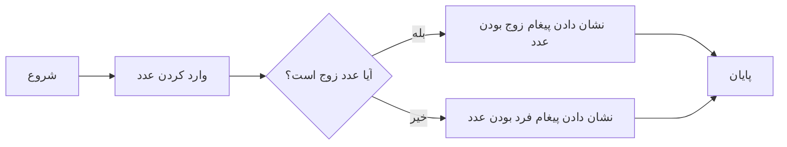
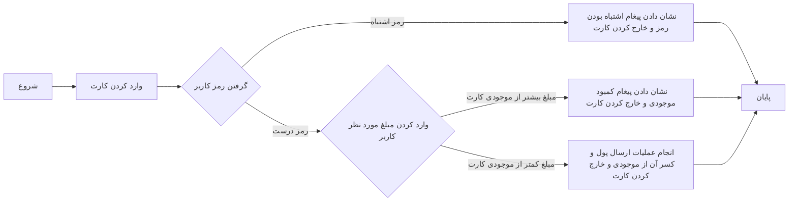

# مقدمه

### برنامه نویسی چیست؟

به فرآیند نوشتن دستورالعمل‌های گام به گام، که به عنوان کد شناخته می‌شوند، که به کامپیوتر می‌گوید چگونه یک کار خاص را انجام دهد یا یک مشکل را حل کند برنامه نویسی (Programming) میگوییم.  
به عبارتی دیگر برنامه‌نویسی یک روش برای تبدیل ایده و منطق انسانی به دستورالعمل‌های قابل فهم برای کامپیوتر است.

1. برنامه بررسی زوج بودن عدد:

2. برنامه دستگاه خودپرداز (ATM) برای برداشت پول:

نمونه های بالا مثال هایی برای نشان دادن این است که چطور یک روند خاص و ایده انسانی را میتوان با قاعده تر با استفاده از فلوچارت نشان داد.
اما فلوچارت ها نیز باز دستوراتی قابل فهم برای کامپیوتر نیستند.  
و در اینجاست که زبان های برنامه نویسی ظاهر میشوند.

### زبان برنامه نویسی چیست؟

زبان برنامه‌نویسی (Programming Language) ابزاری است که ما با آن می‌توانیم این دستورها را به کامپیوتر منتقل کنیم. 
همانطور که برای ارتباط انسان ها تعداد بسیار زیادی زبان وجود دارد همانند فارسی,انگلیسی,فرانسوی و...
و هرکدام از این زبان ها نیز قاعده و دستور منحصر به فرد خود را دارند.
برای ارتباط انسان ها با کامپیوتر نیز زبان های برنامه نویسی متنوعی بوجود آمده که هر کدام قواعد خود را دارند که با زبان های دیگر برنامه نویسی متفاوته.  
چند تا از زبان های معروف برنامه نویسی:  
!!! note
    * C
    * ++C
    * Java
    * Python
    * PHP
    ...
در اینجا ما با ++C کار میکنیم ولی وقتی منطق برنامه نویسی رو به طور کلی یادبگیرین دیگه یادگرفتن زبان جدید اونقدر سخت نخواهد بود.

### زبان ++C چیست و چه تاریخچه ای دارد؟

++C زبانی چند منظوره و سطح میانی است که از برنامه‌نویسی شی‌گرا، رویه‌ای و همگانی پشتیبانی می‌کند. ++C یکی از پرتقاضاترین زبان‌های برنامه‌نویسی امروزی است که تاریخچه آن به بیش از ۴۰ سال پیش بازمی‌گردد و با گذشت چندین دهه، همچنان محبوبیت خود را حفظ کرده است. 
یکی از دلایل محبوبیت این زبان سرعت بالای آن نسبت به زبان های برنامه نویسی دیگر است.

### چرا ++C یاد بگیریم؟

++C یک زبان برنامه‌نویسی مهم برای دانشجویان و متخصصان شاغل است تا به توسعه‌دهندگان نرم‌افزار بزرگی تبدیل شوند. در اینجا برخی از مزایای کلیدی یادگیری ++C را فهرست می‌کنم:

!!! tip "نکته"
    * ++C بسیار به سخت‌افزار نزدیک است، بنابراین شما فرصتی برای کار در سطح پایین دارید که به شما کنترل زیادی از نظر مدیریت حافظه، عملکرد بهتر و در نهایت، توسعه نرم‌افزار قوی می‌دهد.
    * ++C یکی از زبان‌های برنامه‌نویسی همیشه محبوب است و میلیون‌ها توسعه‌دهنده نرم‌افزار آن را دوست دارند. اگر شما یک برنامه‌نویس عالی ++C باشید، هرگز بیکار نخواهید نشست و مهمتر از آن، برای کار خود حقوق بالایی دریافت خواهید کرد.
    * ++C پرکاربردترین زبان برنامه‌نویسی در برنامه‌نویسی کاربردی و سیستمی است. بنابراین می‌توانید حوزه مورد علاقه خود را در توسعه نرم‌افزار انتخاب کنید.

 

