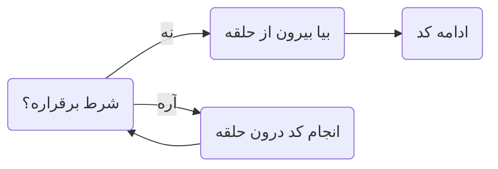
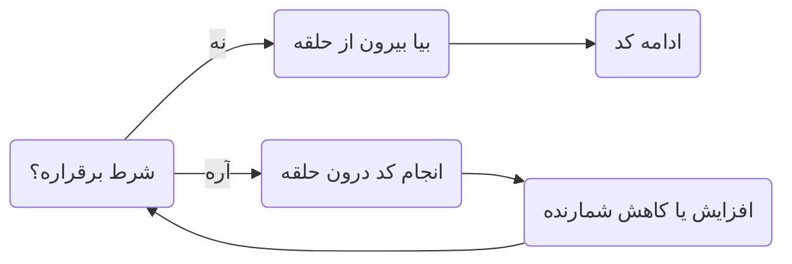

در بسیاری از مواقع، ما نیاز داریم که بخشی از کدمون چندین بار اجرا بشه. در چنین مواقع به جای نوشتن کد تکراری، از حلقه ها
استفاده می کنیم.


## while

> وقتی به تکرار بخشی از کد نیاز داریم اما به طور دقیق **از تعداد تکرار با خبر نیستیم** از `while` استفاده می کنیم.

در حلقه `while` تا زمانی که شرط داده شده `true` است، کد درون اسکوپ رو اجرا می کنه.

<div align="center">

</div> 

برای استفاده از `while` از سینتکس زیر استفاده کنید.

```cpp
while (CONDITION) {
    // some repeating code pattern
}
```

به عنوان مثال:

```cpp
int x = 5;
while (x < 10) {
    cout << x << " ";
    x++; //(1)!
}

// output: 5 6 7 8 9
```

1. !!! danger
       یادتون نره که x رو زیاد کنید، چرا که در غیر این صورت این حلقه بینهایت بار اجرا میشه و با تعداد بسیار زیادی 5
       مواجه میشید!


!!! note "do while"
    `do while` ها نوعی دیگر از `while` به حساب میان که در بعضی مواقع خاص کاربرد دارن.
    `do while` به این صورته که یک بار کد درون اسکوپش رو اجرا میکنه و بعد از اون مانند `while` عادی اول شرط رو چک می کنه
    و تا وقتی که شرط `true` بود، کد درون اسکوپ رو اجرا می کنه.

    سینتکس `do while` به این صورته:

    ```cpp
    do {
        // some repeating code pattern
    } while (CONDITION);
    ```

## for

> وقتی به تکرار بخشی از کد نیاز داریم و **از تعداد دقیق آن با خبریم** از حلقه `for` استفاده می کنیم.

در حلقه `for` اول شرط بررسی میشه و در صورت `true` بودن کد درون اسکوپ اجرا میشه و بعد از تموم شدن بلوک کد، افزایش یا کاهش
شمارنده اتفاق میفته و دوباره فرایند بررسی شرط انجام میشه.

<div align="center">

</div> 

برای استفاده از `for` از سینتکس زیر استفاده کنید.

```cpp
for (DATA_TYPE NAME = INITIAL_VALUE; CONDITION; CHANGES) {
    // some repeating code pattern
}
```

به عنوان مثال:

```cpp
int n;
cin >> n;
for (int i = 0; i < n; i++) {
    cout << i << " ";
}

// input: 5
// output: 0 1 2 3 4 
```

و یکی از مرسوم ترین جا ها برای استفاده از `for` در ورودی گرفتن یا خروجی دادن [آرایه ها](Array.md) است.

```cpp
int n;
cin >> n  

int arr[n];
for (int i = 0; i < n; i++) {
    cin >> arr[i];
}
```

همچنین میتونیم از چند حلقه داخل هم دیگه استفاده کنیم. مثلا کد زیر یک عدد ورودی میگیره و یک مربع به ضلع ورودی گرفته شده
از `*` ها میسازه.

```cpp
int n;
cin >> n;
for (int i = 0; i < n; i++) {
    for (int j = 0; j < n; j++) { //(1)!
        cout << '*';
    }
    cout << endl;
}
```

1. !!! danger
    حواستون باشه که نام شمارنده حلقه هایی که درون یکدیگر اجرا میشن باید با همدیگه متفاوت باشن.
    اما نام شمارنده چند حلفه بیرون هم میتونن یکسان باشن. چرا که این شمارنده ها لوکال تعریف میشن.

        ```cpp
        for (int i = 0; i < 10; i++) {
            // do some work
        }

        for (int i = 0; i < 20; i++) {
            // do some other work
        }
        ```

## Jump Statements

### ;break

در گذشته در قسمت [`switch`](decisionMaking.md/#switch) ها با عبارت `break;` آشنا شده بودید. هدف این عبارت خروج از `switch`
و نادیده گرفتن بقیه `case` ها بود. در حلقه ها هم تا حدی عملکرد مشابه داره و برای خروج از حلقه و اجرای بقیه کد استفاده
میشه.

به عنوان مثال برنامه زیر از کاربر تا زمانی که عدد 11 رو وارد نکرده، ورودی میگیره.

```cpp
while (true) {
    int x;
    cin >> x;
    if (x == 11) {
        break;
    }
}
```
### ;continue

با استفاده از `;continue` یک گردش حلقه همونجا متوقف میشه و به سراغ گردش بعدی حلقه میره.

```cpp
int n;
cin >> n;
for (int i = 0; i < n; i++) {
    if (i == 3) {
        continue;
    }
    cout << i << " ";
}

// input: 7
// output: 0 1 2 4 5 6 
```

!!!example "مثال" 
    لزوما قرار نیست ++i داشته باشیم برای تغییرات: <br>

    ```cpp
    int n;
    cin >> n;
    for (int i = n; i >= 0; i--) {
        cout << i << ' ';
    }
    // input: 7
    // output: 7 6 5 4 3 2 1 0
    ```

    ```cpp
    int n;
    cin >> n;
    for (int i = 1; i < n; i *= 2) {
        cout << i << ' ';
    }

    // input: 9
    // output: 1 2 4 8
    ```